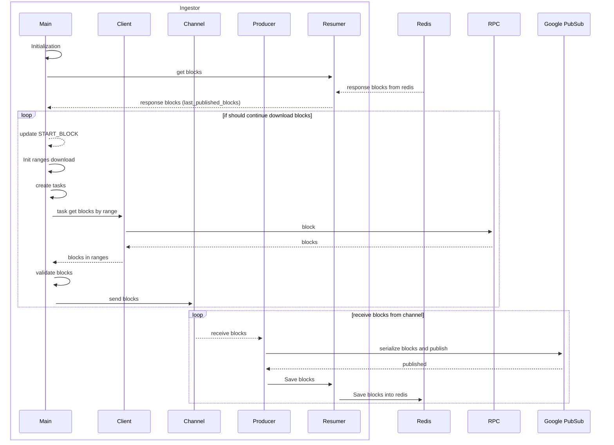
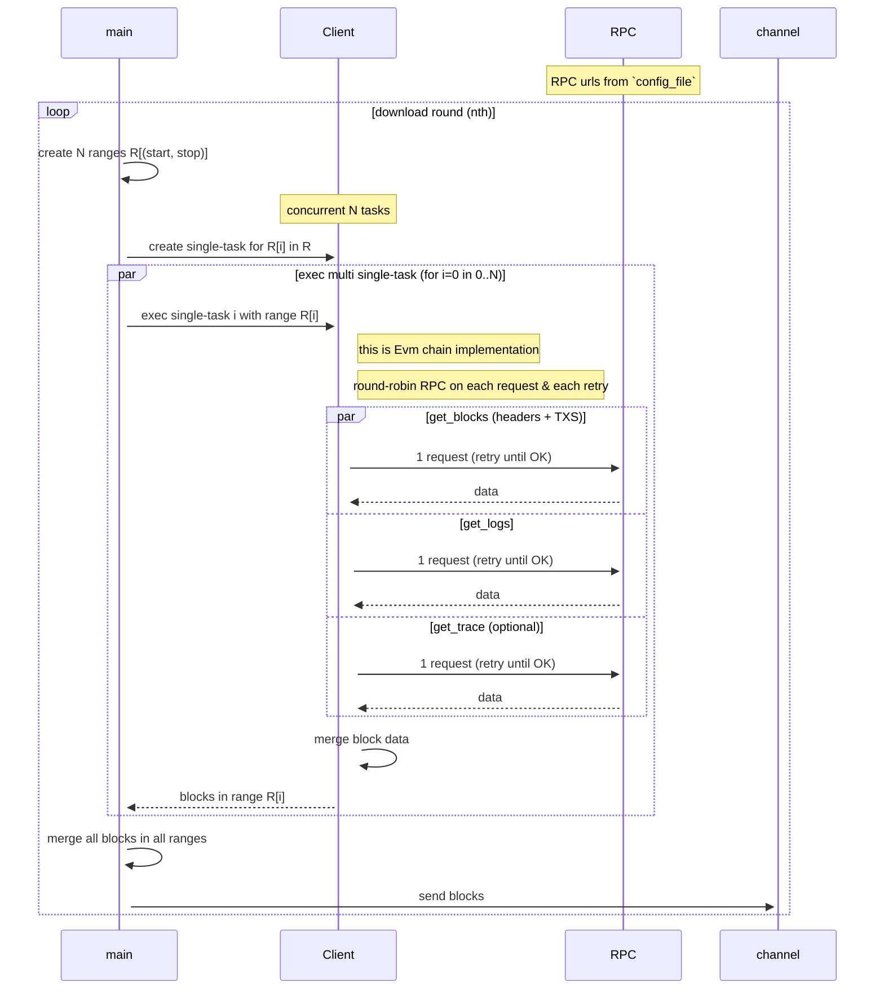
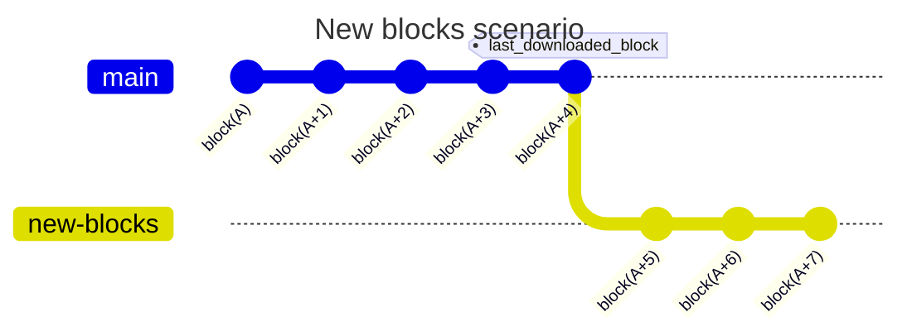
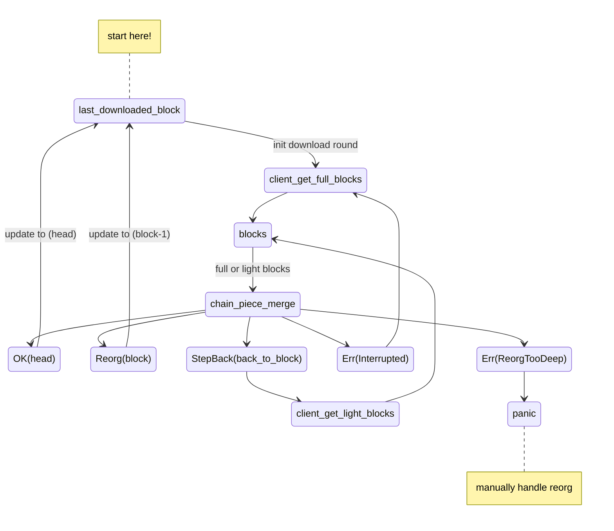

# Delta Ingestor

##  Quick start
```sh
./target/release/ingestor \
--start-block 10000000 \
--stop-block 10150000 \
--batch 50 \
--task-limit 50 \
--channel-size 2 \
--block-zorder 5000 \
--config secrets/ethereum.toml \
--request-timeout 50 --producer delta --resumer redis://localhost:6379 --block-descriptor ./ingestor/src/proto/ethereum.desc
```


Ingest block data from Blockchain node & save to DeltaLake.

# Config & Mode

To run ingestor, some values must be configured.

The values can be passed using **EnvironmentVariables** or using `cli flag`

There are optional & required values. Some required values are provided with default values so it can be ignored if the default values work fine. Based on the configuration scenario, Ingestor can be run in different mode

### Config value table

| ENV Name | CLI FLAGS | Type | Default Value | Recommended | Description |
| --- | --- | --- | --- | --- | --- |
| RUST_LOG |  | info,debug,warn | none | info | Show log level (info, trace, debug) |
| START_BLOCK | —start-block | number, Required | 0 |  | block number to start download |
| STOP_BLOCK | —stop-block | number, optional | none |  | block number to finish |
| BLOCK_TIME | —block-time | u16 | 20 | Depend on chain | block time used to determine how many seconds to sleep waiting for chain update if ingestor catches up with chain’s latest block |
| REORG_THRESHOLD | —reorg-threshold | u16 | 200 |  | determine number of blocks to keep in memory for handling reorg |
| PRODUCER | —producer | string |  | pubsub | determine the kind of producer to use, stdout if None |
| RESUMER | —resumer | string | none |  | redis://redis_host if use Redis, stdout if None |
| KEY_PREFIX | —key-prefix | string | bedrock |  | default prefix value for redis keys and topic name |
| CONFIG_KEY | —config-key | string | use NameService |  | redis key of live config |
| RESUMER_KEY | —resumer-key | string | use NameService |  | redis key for resuming |
| BATCH | —batch | u8 | 10 | 5-10 | Batch size to download.  |
| TASK_LIMIT | —task-limit | u8 | 30 | 20 | Number of tasks that will execute the download task |
| LOAD_BALANCER_BLOCKING | —lb-blocking | u8 | 20 |  | RPC idle time when limited |
| METRICS_PORT | —metrics-port | u32 | 8060 |  | prometheus service port |
| CHANNEL_SIZE | —channel-size | u8 | 50 | 5 | Number of downloaded block pool create in memory |
| REQUEST_TIMEOUT | —request-timeout | u8 | 5 |  | http request timeout |
| BLOCK_ZORDER | —block-zorder | u32 | 5000 | depend on chain | bulldozer compacting/block file partitioning |
| CONFIG_FILE | —config | string | /etc/config/config.toml | use the sample_eth_config.toml in /secrets/ | config file RPC list endpoints  by chain |

Example command:

```bash
RUST_LOG=info cargo run -p ingestor -- \
--start-block 0 \
--stop-block 200000 \
--batch 10 \
--task-limit 30 \
--channel-size 2 \
--config secrets/config.toml \
--request-timeout 1 \
--resumer redis://localhost:6379
--block-zorder 5000 // default: 5000
```

### Ingestor Mode

Based on the presence of some of the values indicating the availability of external data stores, the Ingestor can be run in 4 different modes

```rust
#[derive(Debug)]
pub enum IngestorMode {
    Full,
    NoProducer,
    NoResumer,
    StdOut,
}
```

The minimum required values for each mode are following:

- **Full:**

    *resumable ingestor using redis. ingestor can be turning while running using redis as an external config store*

    - PRODUCER (env or cli-flag)
    - RESUMER (env or cli-flag)
- **NoProducer:**

    *resumable using redis, but data are only printed to stdout*

    - RESUMER (env or cli-flag)
- **NoResumer:**

    *not-resumable if crash, publish data to GooglePubSub. cannot tunning the ingestor configuration when running*

    - GOOGLE_APPLICATION_CREDENTIALS (env)
    - PRODUCER (env or cli-flag)
- **StdOut**

    *No resuming, no publishing, only printing stdout. Mostly for testing locally*

    - Missing all values defined in **Full** mode

### MockChain Ingestor
```sh
cargo run -p ingestor -- \
--start-block 10 \
--batch 5 \
--task-limit 5 \
--channel-size 2 \
--request-timeout 2 \
--config config.toml \
--block-time 5 \
--chain mock
```

Go to `http://localhost:8080` to see the API doc on how to interact with **MockChain**

- Running Mockchain Ingestor with LakeFS Producer
```sh
$ LAKEFS_ENDPOINT=localhost:8000 LAKEFS_ACCESS_KEY=lakefs_root LAKEFS_SECRET_KEY=lakefs_root RUST_LOG=info cargo run -p ingestor -- \
--start-block 0 \
--batch 10 \
--task-limit 2 \
--channel-size 2 \
--request-timeout 2 \
--config config.toml --block-time 5 --chain mock --producer lakefs --block-descriptor ingestor/src/proto/mockchain.desc
```

# Ingestor core

## Abstract Data Types

### BlockTrait

Ingestor deals with BlockChain. The abstract data type of BlockChain is BlockTrait. User can implement more Chain by defining its Block that implements BlockTrait

Any type of block to satisfy BlockTrait must implement methods that…

- get block’s number, block hash and its parent-hash
- can serialize to protobuf message
- can be cloned & used across threads
- can be init-ed with `Default`
- can be init-ed using `(block_number, hash, parent_hash)`

```rust
pub trait BlockTrait:
    prost::Message + Default + From<(u64, String, String)> + Clone + Send + 'static
{
    fn get_number(&self) -> u64;
    fn get_hash(&self) -> String;
    fn get_parent_hash(&self) -> String;
}
```

## Abstract Actors

The Ingestor is designed using **Actor Pattern**. It consists of the following modules (*actors*):

1. **Client**: handle fetching block data from remote data source. By the nature of blockchain, its trait dictates the following methods:
    1. `get_latest_block_number()`: get latest block number of the current chain
    2. `get_full_blocks(sorted_block_numbers)`: get full block data from rpc
    3. `get_light_blocks(sorted_block_numbers)`: get only minimum block data from rpc, help deal with reorg / tracing data quickly
    4. `set_blocking_round(round)`: in case of rate limit, client will block(skip) the failing RPC for next **X** download rounds
2. **Producer**: handle publishing data to external source, only 2 methods required
    1. `publish_block`: publish a single block
    2. `publish_blocks`: publish multiple, sequential blocks
3. **Resumer**: handle resuming the progress in case of failure/panic/crash.
    1. `save_checkpoint_blocks(blocks)`: save the most recently published blocks to store
    2. `get_checkpoint_blocks(blocks)`: get the recently published blocks from store
4. **channel**: an in-memory **fifo** queue serves as a communication bridge between **Client** & **Producer.** The size of this queue is defined by ***Config*** `channel-size` value . Currently we are using **[flume-channel](https://github.com/zesterer/flume).**

All the actors above are defined as abstract. The specific implementations might vary depending on the type of chain.

## Abstract Logic (Core Logic)

### Overview

This ensures all underlying implementation of each actor shall conform to the defined main logic.

Logic Diagram



### Detailed explanation

### **Initialization**

The initialization is the entry to a running, usable Ingestor - that’s why it employs the **fail-fast strategy**: if any steps below fail, panic immediately!

1. *Read & validate config value either from ENV or CLI Flags, determine **Ingestor’s Mode***
2. *Read & validate **RPC Config File***
3. *Test all RPCs, filter only usable RPC only (chain type? response time? support methods?) The minimum number of usable RPCs required depends on type of chain and type of data.*
4. *Init **Client** using the validated RPCs.*
5. *Validate **Producer** config, try init*
6. *Validate **Resumer** config, try init*
7. *Init an **Ingestor** (this will be mostly always successful!)*
8. *Start metric server*
9. *Init communication **channel** with Config’s ****`channel_size`*

### **Scheduling jobs**

Spawning 2 concurrent *looping* jobs by calling `ingest_blocks` method of **Ingestor**, one for *Download with* **Client** and the other for *Publishing using* **Producer.**

Communication is via flume’s **channel.**

The **Ingestor** stops when either both jobs are finished or an error has been thrown.

```rust
let (sender, receiver) = channel(channel_size);

try_join! {
    self.task_download_blocks(sender),
    self.task_publish_blocks(receiver),
}?;
```

### Task Download Blocks

1. **Preparation**

    Read config value, read **Resumer** to see if there are any recent blocks, so it can resume the progress, or start a new one.

    The output of this step is the `STOP_BLOCK` (which can be either ********None******** or a specific number) and `last_downloaded_block` (None if no saved blocks in **Resumer**)

    Create an instance of **ChainPiece** to help with block validation & reorg handling.

    Load the checkpoint-blocks to **ChainPiece** if possible.

    Get the `latest_block_on_chain` from RPC to help determine the exit condition of the loop

2. **Run in loop**

    With each round, determine the `actual_start_block` and `actual_stop_block`

    ```python
    actual_start_block = last_downloaded_block or START_BLOCK
    actual_stop_block = min(STOP_BLOCK or Infinity, latest_block_on_chain)
    ```

    *If the `actual_start_block > actual_stop_block` , depends on the existence of `STOP_BLOCK` or `STOP_BLOCK > latest_block_on_chain` condition, it can decide to break the loop **OR** sleep for 10s to wait for more new blocks before continue. In case of sleeping and wait, after awake, update value `latest_block_on_chain` again.*

    Using `actual_start_block` , `actual_stop_block` , config’s  `TASK_LIMIT` and `BATCH` , generate download tasks and execute them to download blocks.

    ***Client‘s** implementation for download should have infinite retry to ensure success.*

    Download blocks are validated & merged to **ChainPiece** (ensuring blocks are properly linked and/or reorg handling)

    Forward validated blocks to **Task Publish Blocks** via **channel**


### Task Publish Blocks

1. **Preparation**

    Creating an instance of **ChainPiece**.

    Load checkpoint-blocks from **Resumer** if possible.

2. **Run in loop**

    Upon receiving blocks via **channel**, Producer will publish the blocks.

    Create a new list of checkpoint-blocks ************by merging the newly received blocks to **ChainPiece.**

    Save the checkpoint-blocks from **ChainPiece** to **Resumer** (infinite retry)


### Concurrent Download Tasks Group

The **create_ranges** function generates a list of tuples containing start and end blocks for a given range of blocks. It takes four arguments; `start_block`, `stop_block`, `batch_size`, and `task_limit`.

The `start_block` and `stop_block` arguments define the start and stop blocks of the overall range, while the `batch_size` argument defines how many blocks should be included in each range tuple. The `task_limit` argument determines the maximum number of ranges that should be generated.

The concurrent download task is based on creating block ranges - each of which will be sent to a single concurrent task that **Client** will  accept as argument and make requests to RPC to fulfill it

Example:

```rust
let task_limit = 3;
let start_block = 1;
let stop_block = 10;
let batch_size = 3;
let ranges = [
    (1, 2, 3), //task 1
    (4, 5, 6), //task 2
  (7, 8, 9), //task 3
]; // because task_limit=3, there won't be block 10
```

The `download_tasks` function is generated from the `ranges` variable. It takes an array of tasks and calls the `get_blocks` method of the client.

For example:

```rust
let ranges = [(1,2,3),(4,5,6),(7,8,9)];
let download_tasks = [
 get_blocks((1,3)), //task 1 get blocks by range from 1 to 3
 get_blocks((4,6)), //task 2 get blocks by range from 4 to 6
 get_blocks((7,9)), //task 3 get blocks by range from 7 to 9
];

```

Download Concurrency Tasks diagram:



The number of ranges **N** in each download round will be based on the config’s `TASK_LIMIT` and the current available blocks from chain

The number of blocks in each range will be based on the config’s `BATCH` value

### Block validation & Reorg handling

### **Basics**

The Ingestor downloads blocks in sorted order. The fundamental validation is to confirm ***continuity*** (blocks are correctly linked together):

- `Block numbers are incremental`
- `Block hashes & parent-hashes are properly linked together`

The pseudocode for this is

```python
def are_blocks_valid(blocks):
    for idx in 1..len(blocks):
            # Skip idx = 0 because no parent block
            block = blocks[idx]
        parent_block = blocks[idx - 1]

            if block.number - 1 != parent_block.number:
                    return False

        if block.parent_hash != parent_block.hash:
                    return False

            continue

    return True
```

Since the **Ingestor** synchronously downloads blocks in ranges, every newly downloaded blocks must also be linked to the previously downloaded blocks.

Therefore, it is necessary to store some of the most recently downloaded blocks in memory for validation. The *first block of the new blocks* will be checked against *the last block of the last downloaded blocks*.

To enable the **Ingestor** to resume progress when restarted, the in-memory blocks needs to be stored externally in the **Resumer** as well (*checkpoint-blocks*)

### **Reorg Handling Algorithm**

### **Facts & assumptions**

When backfilling (no reorg), store only *the last block from the previously downloaded blocks* to help with validation & resuming. Infinite retry download if validation fails.

When downloading latest blocks, reorg happens often. Without proper handling, the published blocks becomes invalid - and reorg blocks are missed forever.

The depth of reorg varies greatly depending on the chain (from few blocks to hundred of blocks)

With real-time block ingestion, store a specific number **`N`** of latest downloaded blocks in memory *(N > max reorg-depth ever per chain).* This number is set by config value `REORG_THRESHOLD`

### **The Algorithm**

Consider an example using *gitgraph* below, with `REORG_THRESHOLD=5` , where:

- ***main:*** an in-memory piece of chain that keeps most recent downloaded blocks (5 blocks)
- **new-blocks:** newly downloaded blocks;
- `last_downloaded_block = (A+4)`



Validate the new blocks by asserting the continuity from `block(A+4)`to `block(A+7)`  (t*he assertion is fail-fast - returns immediately if 2 blocks are not correctly linked*).

There will be 3 possible cases of the result

1. **the assertion passed, the new blocks are good**

    ```mermaid
    ---
    title: Case (1)
    ---
    gitGraph
       commit id: "block(A)"
       commit id: "block(A+1)"
         commit id: "block(A+2)"
       commit id: "block(A+3)"
       commit id: "block(A+4)"
       commit id: "block(A+5)" type: HIGHLIGHT
       commit id: "block(A+6)" type: HIGHLIGHT
       commit id: "block(A+7)" type: HIGHLIGHT tag: "last_downloaded_block"

    ```

    Merge the new blocks with the current blocks

    Update `last_downloaded_block = (A+7)`then move forward (note that ***this does not guarantee the blocks’ finality*** - they can still be reorg-ed later)

2. **interruption happened between any 2 new blocks**

    ```mermaid
    ---
    title: Case (2)
    ---
    gitGraph
       commit id: "block(A)"
       commit id: "block(A+1)"
         commit id: "block(A+2)"
       commit id: "block(A+3)"
       commit id: "block(A+4)"
       branch new-blocks
       checkout new-blocks
       commit id: "block(A+5)"
       commit id: "block(A+6)" type: REVERSE
       commit id: "block(A+7)"
    ```

    Either the data is bad or reorg happened in the middle of download progress.

    If reorg, by now the depth of this reorg is not determined. The new blocks is a mix of before-reorg blocks & after-reorg blocks. To unify them, *retry download to obtain only after-reorg blocks*, validate them until the assertion result falls into ***case #1** or **#3:***

    - if reorg-block > `block(A+4)` : after retry, new blocks will be valid to proceed to **[case #1](https://www.notion.so/Ingestor-Docs-9591f8a4abc64f5ba5c970c327d7aa0f?pvs=21)**
    - If reorg-block < `block(A+5)` : after retry, new blocks will be valid but `block(A+4)` and `block(A+5)` are not connected (**[case #3](https://www.notion.so/Ingestor-Docs-9591f8a4abc64f5ba5c970c327d7aa0f?pvs=21)**)
3. **Interruption between `block(A+4)` & `block(A+5)`**

    ```mermaid
    ---
    title: Case (3)
    ---
    gitGraph
       commit id: "block(A)"
       commit id: "block(A+1)"
         commit id: "block(A+2)"
       commit id: "block(A+3)"
       commit id: "block(A+4)"
       branch new-blocks
       checkout new-blocks
       commit id: "block(A+5)" type: REVERSE
       commit id: "block(A+6)"
       commit id: "block(A+7)"
    ```

    Reorg happened somewhere from `block(A)` to `block(A+4)`

    To find the reorg-block,  keep downloading blocks backward from `block(A+4)` to `block(A)` for comparison. (*to fasten the process and as we only care about block number and hash, we use Client `get_light_blocks` method)*

    Iterate through re-downloaded blocks to find reorg-block `X` that is:

    - `X is not on main`
    - `X's parent-block is on main`

    ```mermaid
    ---
    title: Example where Reorg-block X = (A+3)
    ---
    gitGraph
        commit id: "block(A)"
        commit id: "block(A+1)"
        commit id: "block(A+2)"
        branch re-downloaded
        checkout re-downloaded
        commit id: "**block(A+3)"
        commit id: "**block(A+4)"
        checkout main
        commit id: "block(A+3)"
        commit id: "block(A+4)"
    ```

    Once found, discard all the blocks on main where block-number ≥ reorg-block X (A+3)

    ```mermaid
    ---
    title: Merge re-dowloaded to main
    ---
    gitGraph
        commit id: "block(A)"
        commit id: "block(A+1)"
        commit id: "block(A+2)" tag: "last_downloaded_block"
        commit id: "**block(A+3)" type: REVERSE
        commit id: "**block(A+4)" type: REVERSE
    ```

    *Here we cannot merge the **re-downloaded** blocks to **main** because, the re-downloaded blocks are not full blocks - hence not usable. We still need to re-download the full blocks - and to do that the Client need exact value of `last_downloaded_block`*

    Mark success. Notify the **Client** about the revert `last_downloaded_block = (A+2)`


### The ChainPiece

The ChainPiece module is a concrete implementation of The Algorithm for reorg handling.

ChainPiece keeps 2 data structures to represent part of the chain that contains our latest downloaded blocks:

- **a HashMap (block-number → block-hash)**: help lookup block-hash using block number
- **a Deque of block-number**: list of sorted block number, can be extended and shortened by ***popping item back or front***

*Because the ChainPiece employs composite data structure strategy, it is intended used in single-threaded environment.*

The ChainPiece has the following methods (`B` = abstract block type)

- `new() → Self`
- `is_on_chain(&self, block: B) -> bool`
- `is_parent_on_chain(&self, block: B) -> bool`
- `append_new_block(&mut self, block: B)`
- `remove_head_block(&mut self, remove_head: int) -> bool` discard block at head of the deque up to the remove_head
- `check_blocks_continuity(&self, blocks: B[]) -> bool`
- `merge(&mut self, blocks: B[]) -> Ok | Err` merge new blocks to its chain, OK if merge OK or Reorg-block found, Error if otherwise
- `extract_blocks(&self) -> B[]` extract minimal block data of blocks on its chain (help with saving checkpoints)

Feed new downloaded blocks to `merge` method of ChainPiece, the result type are as follow:

```rust
/// If result is OK
enum MergeStatus {
    // merge new blocks OK
    Ok(u64),
    // a reorg-block found
    Reorg(u64),
}

/// if result is Error
enum Error {
    // When REORG_THRESHOLD is too small to handle reorg
    ReorgTooDeep,
    // Continuity check fail,
    // Inner value is none if ChainPiece has no blocks
    Interrupted(Option<u64>),
    // Cannot determine reorg depth,
    // revert further to block in Inner value
    StepBack(u64), //
}
```

The ChainPiece when used with Ingestor’s `task_download_block`, its flow is described as below diagram



Another ChainPiece instance must be used with Ingestor’s `task_publish_block` to mirror the changes from the `task_download_block` ChainPiece instance and save to **Resumer.**

## Actor Implementations

*Under construction*

### **Client**

### Ethereum

Some public RPCs do not support certain methods, such as get_logs and get_trace_call. Therefore, we need to check the RPC before using these methods.

To filter the RPC:

- If the RPC supports getting logs, set the RPC to **Archive Type**.
- If the RPC supports getting trace_call, set the RPC to **Trace Type**.
- Otherwise, if the RPC can only get block header and transactions, set the RPC to **Light Type**.

### **Producer**

The producer serializes downloaded blocks into protobuf messages and publish them to Google Pub/Sub. If consuming order is required, publishing order is required too by using non-empty ordering-key

GooglePubSub has some limit for publishing

- Maximum request size = 10Mb
- Maximum number of messages per request = 1000
- Maximum throughput per ordering-key = 1Mb/s

Because of this, splitting algorithm is applied to slice blocks array to multiple groups that fits the requirement

On throughput error, producer will infinitely retry with exponential-backoff

### Resumer

Now has only 1 implementation using Redis

Use `hmap` to store recent downloaded blocks, the key name can be manually configured or auto config using NameService

- key: `block number`
- value: `{block-hash}:{parent-hash}`

Every time a group blocks get published successfully, this map will be complete overwritten.

## NameService

To prevent errors/misconfigurations/misuse when dealing with names, we use **NameService** to setup the following values

- `RESUMER_KEY` : the key in resumer(redis) which we use to store recent blocks that help resuming
- `CONFIG_KEY`: the key in redis which we use to store adjustable config - which we can change Ingestor’s behavior on the fly

```rust
pub struct NameService {
    pub resumer_key: String,
    pub config_key: String,
}
```

The NameService will be init-ed using input [Config](https://www.notion.so/Ingestor-Docs-9591f8a4abc64f5ba5c970c327d7aa0f?pvs=21) & the ChainType that we are working with.

```rust
pub enum ChainType {
    Ethereum(EvmChainName),
}
```

There are `KEY_PREFIX` from Config that add custom prefix value to each name in **NameService**

The values from **NameService** can be overridden if `config_key` and/or `resumer_key` are specified in Config.

Unless specified in Config, NameService’ names will include the following values as part of the names:

- blocks_range: `{START_BLOCK}_{STOP_BLOCK}`

    example: `10000_11000` (stop_bock defined) or `10000_latest` (stop_block not defined)

- KEY_PREFIX: default to `bedrock`

### For Ethereum

EVM chain names are automatically setup using `chain_id` obtained from the RPC. The known names are as following

```rust
#[derive(Debug)]
pub enum EvmChainName {
    Ethereum,
    Bsc,
    Polygon,
    Optimism,
    Fantom,
    Avalanche,
    Arbitrum,
    Unknown,
}

impl From<u64> for EvmChainName {
    fn from(chain_id: u64) -> Self {
        match chain_id {
            1 => EvmChainName::Ethereum,
            56 => EvmChainName::Bsc,
            137 => EvmChainName::Polygon,
            10 => EvmChainName::Optimism,
            250 => EvmChainName::Fantom,
            43114 => EvmChainName::Avalanche,
            42161 => EvmChainName::Arbitrum,
            _ => EvmChainName::Unknown,
        }
    }
}
```

The names will be as following:

- resumer_key: `{KEY_PREFIX}_resumer__{chain_name}__{blocks_range}`

    ```
    example:
    **bedrock_resumer__arbitrum__16000000_latest**, or
    **bedrock_resumer__arbitrum__16000000_17000000**
    ```

- config_key: `{KEY_PREFIX}_*config*__{chain_name}__{blocks_range}`

    ```
    example:
    **bedrock_config__polygon__16000000_latest**, or
    **bedrock_config__polygon__16000000_17000000**
    ```

# RoundRobin

The load balancing algorithm used by the RoundRobin client is also explained in detail.

### RoundRobin Algorithm

- Supports `weighted` mode.
- Includes `classic-wrr` and `interleave-wrr`.
- A weight of zero means that items will be ignored from the selection.
- Assumes all inputs are valid. Panic will occur otherwise.
- Resiliency is not supported, meaning if an empty list is passed to the **LoadBalancer**, it will panic immediately.

### Ingestor’s RoundRobinClient

Given we have multiple RPC urls, with each of them we create an atomic, single RPC-Client

To apply round-robin on available RPC urls. We create a wrapper over the underlying normal RPC-Clients.

Every time RoundRobinClient makes a request, its load-balancer will pick one RPC-Client from the client pool to use

Example with pseudo-code:

```bash
let rpcs = ["rpc1", "rpc2", "rpc3"]
let clients = [Client(rpc) for rpc in rpcs]
let rr_client = RoundRobinClient(clients)
```

# Metrics

We use Promethus to observe ingestor’s behavior & performance. The specific metrics are listed with comments in the following code block

Default endpoint path: `:8060/metrics`

```rust
pub struct IngestorMetrics {
        // A static value, indicating the start-block at start-up of the Ingestor.
        // The value mostly comes from config or checkpoint store
        // and does not change over time
    pub ingestor_start_block: IntCounter,
        // A static value, indicating stop block of the process
    pub ingestor_target_block: IntCounter,
        // The latest published block, can increase or decrease if reorg
    pub last_published_block: IntGauge,
        // The latest downloaded block, can increase or decrease if reorg
    pub last_downloaded_block: IntGauge,
        // Count how many blocks have been downloaded from start
    pub downloaded_blocks_counter: IntCounter,
        // Count how many blocks have been published from start
    pub published_blocks_counter: IntCounter,
        // Histogram that observes the time each publish request cost
    pub publish_request_duration: Histogram,
        // Histogram that observes the time that download cost,
        // either single-task or group-task
    pub blocks_download_duration: HistogramVec,
        // Static value, showing config values that needs observing
    pub config_gauge: IntGaugeVec,
}
```

# Deployment

This document provides configuration and deployment instructions for the Ingestor, including recommended default values for various parameters.

Ref: Example deployment

### Config Topic and Subscriber name

- Topic latest blocks name: `bedrock_blocks__{chain_name}`
    - eth: `bedrock_blocks__eth`
    - bsc: `bedrock_blocks__bsc`
- Topic backfill blocks name: `bedrock_blocks__{chain_name}_backfill`
- Subscriber name: `{topic_name}-sub`

### RPC List Endpoints By Chain

List config RPC by chain tested

This is  `CONFIG_FILE` in **env** above

**Config struct**:

```toml
[chain_name]
//list RPC endpoints
rpc = [
    {
        endpoint = "https://rpc_endpoint",
        weight = 1 // load balancer weight
    }
]
```

- **Sample**:
    - Ethereum

        ```toml
        [ethereum]
        rpc = [
            { endpoint = "https://eth-mainnet.g.alchemy.com/v2/N7gZFcuMkhLTTpdsRLEcDXYIJssj6GsI", weight = 1 },
            { endpoint = "https://api.securerpc.com/v1", weight = 1 },
            { endpoint = "https://ethereum.publicnode.com", weight = 1 },
            { endpoint = "https://eth.llamarpc.com", weight = 1 },
            { endpoint = "https://api.bitstack.com/v1/wNFxbiJyQsSeLrX8RRCHi7NpRxrlErZk/DjShIqLishPCTB9HiMkPHXjUM9CNM9Na/ETH/mainnet", weight = 1 },
            { endpoint = "https://eth-rpc.gateway.pokt.network", weight = 1 },
            { endpoint = "https://rpc.ankr.com/eth", weight = 1 },
            { endpoint = "https://ethereum.blockpi.network/v1/rpc/public", weight = 1 },
            { endpoint = "https://cloudflare-eth.com", weight = 1 },
            { endpoint = "https://rpc.energyweb.org", weight = 1 },
            { endpoint = "https://eth-mainnet-public.unifra.io", weight = 1 },
            { endpoint = "https://eth.api.onfinality.io/public", weight = 1 },
            { endpoint = "https://eth-mainnet.nodereal.io/v1/1659dfb40aa24bbb8153a677b98064d7", weight = 1 },
            { endpoint = "https://rpc.eth.gateway.fm", weight = 1 },
            { endpoint = "https://api.mycryptoapi.com/eth", weight = 1 },
            { endpoint = "https://eth.althea.net", weight = 1 },
            { endpoint = "https://1rpc.io/eth", weight = 1 },
            { endpoint = "https://eth-rpc.1inch.io/", weight = 1 },
            { endpoint = "https://eth-mainnet-rpc.thundercore.com", weight = 1 },
            { endpoint = "https://api.zmok.io/mainnet/oaen6dy8ff6hju9k", weight = 1 },
            { endpoint = "https://mainnet-rpc.thetangle.org", weight = 1 },
            { endpoint = "https://eth-mainnet.rpcfast.com?api_key=xbhWBI1Wkguk8SNMu1bvvLurPGLXmgwYeC4S6g2H7WdwFigZSmPWVZRxrskEQwIf", weight = 1 }
        ]
        ```

    - BSC

        ```toml
        [ethereum]
        rpc = [
            { endpoint = "https://bsc-dataseed.binance.org", weight = 1 },
            { endpoint = "https://bsc-dataseed1.binance.org", weight = 1 },
            { endpoint = "https://bsc-dataseed2.binance.org", weight = 1 },
            { endpoint = "https://bsc-dataseed3.binance.org", weight = 1 },
            { endpoint = "https://bsc-dataseed4.binance.org", weight = 1 },
            { endpoint = "https://bsc-dataseed1.defibit.io", weight = 1 },
            { endpoint = "https://bsc-dataseed2.defibit.io", weight = 1 },
            { endpoint = "https://bsc-dataseed3.defibit.io", weight = 1 },
            { endpoint = "https://bsc-dataseed4.defibit.io", weight = 1 },
            { endpoint = "https://bsc-dataseed1.ninicoin.io", weight = 1 },
            { endpoint = "https://bsc-dataseed2.ninicoin.io", weight = 1 },
            { endpoint = "https://bsc-dataseed3.ninicoin.io", weight = 1 },
            { endpoint = "https://bsc-dataseed4.ninicoin.io", weight = 1 },
        ]
        ```

    - Fantom

        ```toml
        [ethereum]
        rpc = [
            { endpoint = "https://rpcapi.fantom.network", weight = 1 },
            { endpoint = "https://rpc.fantom.network", weight = 1 },
            { endpoint = "https://rpc2.fantom.network", weight = 1 },
            { endpoint = "https://fantom-mainnet.public.blastapi.io", weight = 1 },
            { endpoint = "https://1rpc.io/ftm", weight = 1 },
            { endpoint = "https://fantom.blockpi.network/v1/rpc/public", weight = 1 },
            { endpoint = "https://fantom.publicnode.com", weight = 1 },
            { endpoint = "https://fantom.api.onfinality.io/public", weight = 1 },
            { endpoint = "https://rpc.fantom.gateway.fm", weight = 1 },
            { endpoint = "https://endpoints.omniatech.io/v1/fantom/mainnet/public", weight = 1 },
            { endpoint = "https://fantom-mainnet.gateway.pokt.network/v1/lb/62759259ea1b320039c9e7ac", weight = 1 }
        ]
        ```

    - Polygon

        ```toml
        [ethereum]
        rpc = [
            { endpoint = "https://polygon.llamarpc.com", weight = 1 },
            { endpoint = "https://polygon.rpc.blxrbdn.com", weight = 1 },
            { endpoint = "https://poly-rpc.gateway.pokt.network", weight = 1 },
            { endpoint = "https://polygon.blockpi.network/v1/rpc/public", weight = 1 },
            { endpoint = "https://rpc-mainnet.maticvigil.com", weight = 1 },
            { endpoint = "https://rpc-mainnet.matic.quiknode.pro", weight = 1 },
            { endpoint = "https://endpoints.omniatech.io/v1/matic/mainnet/public", weight = 1 },
            { endpoint = "https://polygon-rpc.com", weight = 1 },
            { endpoint = "https://rpc-mainnet.matic.network", weight = 1 },
            { endpoint = "https://matic-mainnet.chainstacklabs.com", weight = 1 },
            { endpoint = "https://rpc.ankr.com/polygon", weight = 1 },
            { endpoint = "https://1rpc.io/matic", weight = 1 },
            { endpoint = "https://polygon-bor.publicnode.com", weight = 1 },
            { endpoint = "https://polygon.api.onfinality.io/public", weight = 1 },
        ]
        ```

    - Avalanche

        ```toml
        [ethereum]
        rpc = [
            { endpoint = "https://avalanche.blockpi.network/v1/rpc/public", weight = 1 },
            { endpoint = "https://api.avax.network/ext/bc/C/rpc", weight = 1 },
            { endpoint = "https://avalanche.public-rpc.com", weight = 1 },
            { endpoint = "https://rpc.ankr.com/avalanche", weight = 1 },
            { endpoint = "https://ava-mainnet.public.blastapi.io/ext/bc/C/rpc", weight = 1 },
            { endpoint = "https://avalanche-c-chain.publicnode.com", weight = 1 },
            { endpoint = "https://1rpc.io/avax/c", weight = 1 },
            { endpoint = "https://avax-mainnet.gateway.pokt.network/v1/lb/605238bf6b986eea7cf36d5e/ext/bc/C/rpc", weight = 1 },
            { endpoint = "https://avalanche.api.onfinality.io/public/ext/bc/C/rpc", weight = 1 },
            { endpoint = "https://endpoints.omniatech.io/v1/avax/mainnet/public", weight = 1 },
            { endpoint = "https://avax-mainnet.gateway.pokt.network/v1/lb/605238bf6b986eea7cf36d5e/ext/bc/C/rpc", weight = 1 }
        ]
        ```


### Memory Management

The memory required to run Ingestor depends on how much data it will be holding on during its lifetime.

The pending block data that Ingestor keeps between downloading & publishing shall be accounting for 90 to 95% percent of the memory required

The block data size is directly dependent on the config’s `TASK_LIMIT` & `BATCH_SIZE`

*Example: a config of 20 task-limit & 20 batch-size shall result in 400 pending blocks staying in the memory. And because of concurrency, with 400 blocks being in the memory, the Ingestor can be still running and downloading more blocks - so it can be up to 800 blocks in the memory at the same time. Multiply this with the biggest block-size found on chain, eg 250KB, we can determine the blocks will require 200Mb of ram.*

Because these configs are coded to be adjustable during run time, to calculate the exact memory requirement - plus safety factor - it can follow this:

```bash
Memory = TASK_LIMIT x BATCH_SIZE x BLOCK_SIZE x 2
where
    TASK_LIMIT: max-possible task-limit in the download range
    BATCH_SIZE: max-possible batch-size in the download range
    BLOCK_SIZE: max block-size in the download range
    2: safety factor
```
